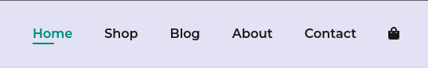
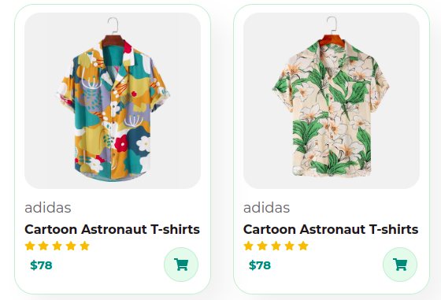

     
    </img>
     
    
ecommerce, Compras realizadas em qualquer aparelho!

     
    
     
     
    </img>
     
     

# Cara:

<!--ts-->

- [Sobre](#sobre)
- [Navegar no website](#navegar)
- [Como usar](#navegar)
  - [Demonstração da aplicação](https://dev-celo.github.io/ecommerce/)
  - [Remote files](https://github.com/dev-celo/ecommerce)
- [Tecnologias](#tecnologias)
<!--te-->

# Sobre:

    

     Cara é um ecommerce completo em vanilla Javascript, onde um dos principais desafios foi o curso completo em inglês no youtube do Tech2 etc.
     Site totalmente responsivo usando media query, se adapta aos principais tipos de telas.
    

     
    

    Trabalho realizado com o pessoal do tech2 etc onde criamos uma página de vendas on-line, com técnicas avanadas de CSS.
    

# Navegar no site:

    <h2>Como navegar em nossa aplicação?</h2>
    

    Você pode navegar entre os itens da nossa página clicando nos seguintes links (que se encontra na parte superior do site):
    

    </img>
     
    

    Se estiver utilizando uma tela menor, provavelmente você terá que abrir o menu(també na parte superior), que estará do lado da bolsa:
    

    </img>
     
    
E logo em seguida terá o seguinte resultado(aba lateral com o menu de navegação):

    </img>
     
    
Caso você clique na bolsa, será direcionado para o carrinho de compras.

    </img>
     
    </img>
     
    
Você poderá efetuar futuramente as compras a partir dos seguintes cards: 

    </img>

   
   
   
  =========================================================
  <h2>✅ Javascript Select 🚀 Projeto concluído...  ✅</h2>
  
✅ Todas as aulas completas!

   
   

### Trabalho realizado com

- [x] HTML5
- [x] CSS3
- [x] Javascript
       

Um dos projetos mais desafiadores para mim. Primeiro porque quando comecei a desenvolver na linguagem C eu sempre me perguntava:

- Como vou fazer algo real? Nessa tela preta não consigo fazer nada.
- Quero um dia conseguir fazer um ecommerce... Será que vou conseguir?

E agora estou com o front - end de um ecommerce concluido.
Agora o projeto só está no inicio, já que agora quero aprender como desenvolver o back - end dessa aplicação.

## Estudado
- Ecommerce Responsivo usando HTML CSS & JavaScript.
- Completo para iniciantes.
- Página web multi-page responsiva.
- Aprendemos como montar uma página profissional.
- Fundamentos de web design.
- CSS Moderno, flexbox e CSS Grid.
- Como usar componentes e layout patterns para um website profissional.
- Design avançado e responsivo com o uso de media queries.

#### Olá me chamo Marcelo, fique à vontade para opinar :)

  
Se você chegou até aqui, muito obrigado por visitar esse perfil! Espero que tenha gostaddo do conteúdo.

  
  Você pode acessar a página [Clicando aqui](https://dev-celo.github.io/ecommerce/)

